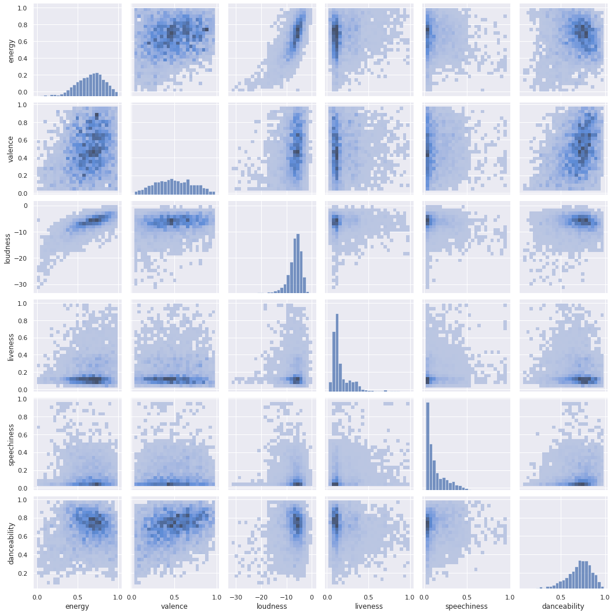
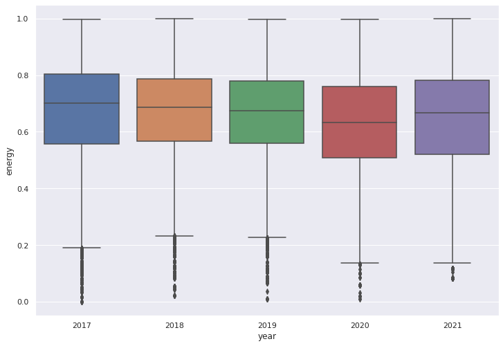
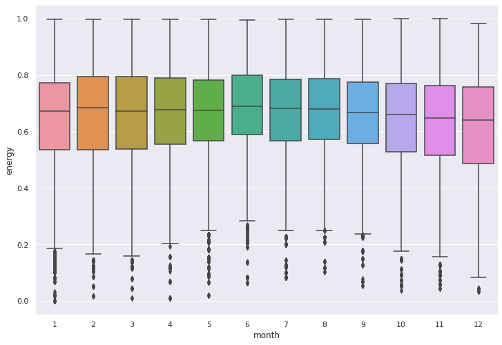
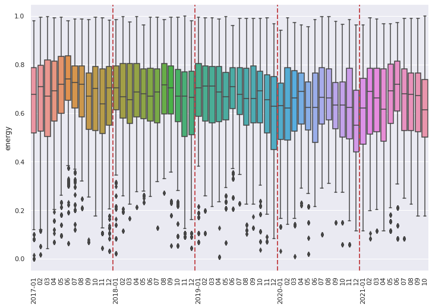
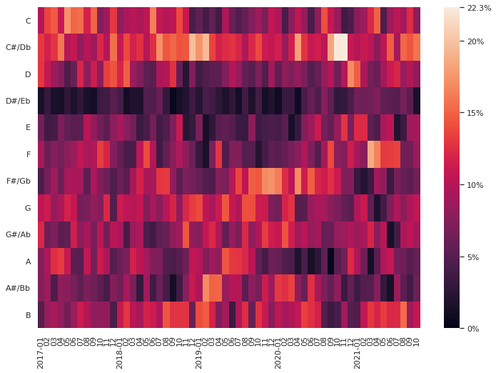

# Exploring Spotify trends over the last three years

**Name:** Franz Sauerwald

Please see the notebook at (https://www.kaggle.com/franzsw/spotify-chart-analysis)[https://www.kaggle.com/franzsw/spotify-chart-analysis] for code with results

## Exercise 1: Two datasets

Spotify offers charts, updated in three-day intervals. We're going to explore what trends there are in the charts regarding the features, meaning characteristics like "acousticness", "vocals", ..., of the music over time. For this we are using two datasets.

1. The Spotify-Charts dataset found on kaggle [https://www.kaggle.com/dhruvildave/spotify-charts]
2. A dataset of "features" for each song. Because I didn't find a good dataset, I'm using the Spotify API audio-features endpoint ([https://developer.spotify.com/documentation/web-api/reference/#/operations/get-several-audio-features]) to get the features for each song.

### Spotify-Charts dataset

The Spotify-Charts dataset has only one csv-file, so all data is present in tabular structure. It contains one playlist track per row. Each row has the attributes title, rank, date, artist, url, region, chart, trend and streams. It contains all playlist states from 2017 to today of many different regions, the file contains 25 512 202 rows.

The most important values for the analysis are `chart`, `region` and `date` as well as `url` to join the playlist tracks with their analysis. Chart is categorical and either `top200` or `viral50` - the two playlists present in the dataset. Region is also categorical, it contains 70 different region names. The playlists are generated for each region independently.

The attributes `title`, `artist`, `url` and `streams` describe the track being present in a playlist at the given `date`. Artist can be seen as multi-categorical data, however multiple artists are concatenated with a comma, so that some preprocessing would be required to use it as such. Streams are the absolute number of streams, meaning "listening sessions".

### Features dataset

The features dataset is also in tabular form (the API returns JSON objects, but I stored them as CSV) in one file. It contains one row per track.

Each row has an `id`, `uri`, `track_href`, `analysis_url` for identifying the track / linking it to the Spotify universe, we use the `id` to merge it with the chart's `url` (by extracting the id from the url and checking for equivalent values).

The interesting attributes for the visualization are Spotify's analysis of the track features. `acousticness`, `danceability`, `energy`, `instrumentalness`, `liveness`, `speechiness`, `valence` each store a 0-1 value describing the feature from "not at all" to "very much". `tempo` is positive number, describing the estimated beats per minute.`key` and `mode` describe the tonality (not sure how to describe it in English), both are categorical, where key is an int from 0 to 11 (0=C, 1=C#, ...) and mode is 1 or 0 for major / minor. `time_signature` is an int from 3 to 7 describing how many beats there are per measure.

## Exercise 2: Exploring (/ visualizing) the data

For the visualizations, I used only the German `viral50` playlist tracks. All in all, it seems to be difficult to draw conclusions from the data without more context / other data sources and a longer time period.

Let's first see a pairplot to see the distribution of the features. Due to the large number of tracks, I used a histogram with 25 bins (in each axis).

As we can see, "energy" and "loudness" behave proportionally as well as "valence" to "danceability", "loudness" and "energy".

Also, we can see, that in the "viral 50" songs generally have a relatively high danceability, loudness and energy, but relatively low speechiness and not many tracks seem to be live performances / audiences in it.

How did the energy of the viral50 develop over time?

### Energy grouped by year

As we can see, the changes in energy are only slight, but in 2020, the energy seems to belower than in the years before 2020 and 2021. This could be related to the Corona pandemic, but as it is only a slight change and because the data does not allow to look at other big crisis / disasters as, e.g., the 2007 stock market crash, it could also just be a random drop.

### Energy grouped by month

We can see that the energy level of the viral50 songs is, again, quite stable, but nonetheless, it seems to be increased during the summer month, the lower quartile is higher than during the winter month. Maybe people tend to hear more energetic songs during the summer month or more artist decide to make their "summer tune" more energetic?

### Energy total

Energy level in viral-50 Germany from Jan 2017 to Oct 2021 (the dashed red lines separate years)

### Keys used in viral50

From the heatmap, we can see that there are a few keys which are found frequently and last for a long time. Most commonly C# seems to be found, but also B and C.
It seems that some keys trend for a rather short amount of time. F# has been a dominant key from around June 2019 to October 2020, but has not been heared a lot before and after this timespan. This could again be coincidence, but also artists getting inspiration from a well received song.

### Conclusion

I also looked at other plots, but didn't find anything exciting :(

It looks like there is not a strong correlation between Spotify viral50 and appearant outside events like the corona crisis.
