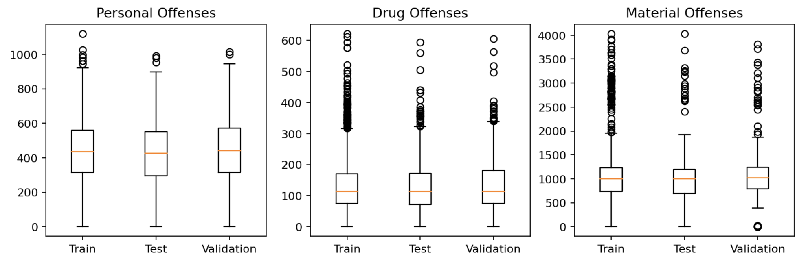
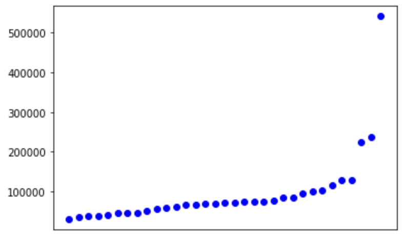
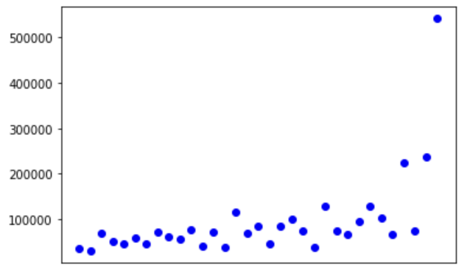

# Machine learning on London crime & housing prices

**Name:** Franz Sauerwald

(Notebook was built on Kaggle: https://www.kaggle.com/franzsw/machine-learning-london-crimes-housing)

## Exercise 1

### a) Merging the data

For this exercise, I used the [Housing in London](https://www.kaggle.com/justinas/housing-in-london) dataset as well as the detailed [London Crime dataset](https://www.kaggle.com/LondonDataStore/london-crime), which is a BigQuery dataset, meaning that we can't access it directly, but have to query the data we want.

For this exercise, I decided to query the number of crimes per month and borough, grouping them into three major categories 'Personal offenses' (Sexual offense, violence), 'Material crimes' (Theft, robbery, etc.) and 'Drugs' - this was done by using the `major_category` column of the `london_crime` dataset.

The housing in London dataset has a monthly and yearly CSV file. I decided to use the monthly one in favour of more training data, however this could also lead to overfitting on specific boroughs instead of learning general patterns.

The most important columns in the housing in london dataset for us are the date as string, the area (name of borough), average_price as int, houses_sold (float). I split the date into a 'year' and 'month' column and applied lowercase to the 'borough' column of the crime query to have them the same in both dataset to merge them.

I then merged the datasets on the 'year', 'month' and 'borough' (/ 'area') columns to have the number of crimes as well as sold houses and prices per month and borough.

### b) Splitting the data into test / training sets

To validate and test our model, we split the data into a test set, validation set and a training set. I split it randomly into 60% training, 20% validation and 20% test. However, in the next exercise I will also explore the effect of leaving one borough out of the training / validation set, but putting it in the test set.

I set a random_state to have reproducible results. This splits results in the following metrics for each set:

|       | Train | Validation | Test |
| ----- | ----- | ---------- | ---- |
| Count | 2138  | 713        | 713  |

Lets also compare the stats of different attributes, to see if our sets are representative of the data.

It looks like the data is well distributed, so the sets are representative of the data.

## Exercise 2

### a) Hypothesis

I want to check the following hypothesis:

1. The average price and number of houses sold can't be inferred with good results on just the crime count. Additional preprocessing / feature extraction would be necessary, e.g. crimes per citizen.
2. A decision tree regressor model will perform ok across the different sets, but only as long as it has seen data from all boroughs. If I leave one borough out of the training set, it won't perform well.
3. A linear regression model will overall have a worse performance, but is more consistent in its predictions, even if a borough is left out of the training set.

### b) Training models

I choose to train one random forest regressor and one linear regression model. I'm using scikit-learn's `RandomForestRegressor` and `LinearRegressor` respectively.

### c) Quantitative evaluation

- Random Forest Regressor: After some hyperparameter tuning (increasing min_samples_leaf, min_samples_split, n_estimators), the model still only gets a score of ~0.36 on the validation and test set. Also the mean absolute error is very high with a deviation of `92219`, while most expected values are between 200k and 500k!
- Linear Regression: The linear regression model gets an even worse mean absolute error of `133616` and score of ~0.07 on the validation set. This means, that it is only slightly better than a model which would always return a constant

This validates the first hypothesis. The mean absolute error is so high, that a prediction is not reliable

### d) Explanation / Analysis of performance

To see when the models perform bad, I group the predictions by area and plot the mean absolute error per area, because I suspect that the area has a huge impact on the model performance.

Here we see one point for each area (x-axis) and the mean error on the y-axis, predicted with the random forest regressor.

Interestingly enough, the linear regression model also shows a similar characteristic:

(Areas kept in same order as for random forest regressor plot)

This could indicate, that the crime data has not enough correlation to the housing prices to be able to predict the prices accurately. When training a model just on the area (one-hot encoded) the model performs better (score ~0.78).

After training on only a subset of the areas and leaving two areas out, the random forest regressor model performs worse, but not by as much as I would have expected (Score 0.6, Mean Abs Error ~56876). While the linear regression model fluctuated around the score it had before. That indicates, that the data is really not suitable for the models to give accurate predictions based on the crime numbers, but always fails for some areas, because of missing correlation.

In the end, this means, that hypothesis 2 is true, the random forest model performs worse when splitting train / test sets by area. Hypothesis 3 is also true, the linear model is more consistent in its predictions, but (capital letter but) it is just very bad, which is expected after seeing that the data does not have enough correlation.

Maybe the model would perform better when more features are extracted before training the model.
